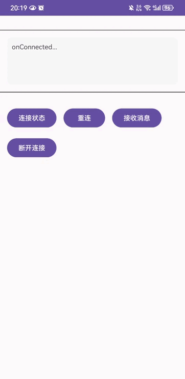

## plexAndroid SDK

- 基于 [Golang Plex](https://github.com/swxctx/plex) 实现
- 操作简便，直接引入 `SDK` 初始化后接收响应回调即可

## 安装使用

- 依赖

```
implementation 'com.github.swxctx:plexAndroid:6c22021afb'
```

- 权限

```
<!-- 允许应用访问网络 -->
<uses-permission android:name="android.permission.INTERNET" />

<!-- 允许应用访问网络状态，可用于检查网络连接 -->
<uses-permission android:name="android.permission.ACCESS_NETWORK_STATE" />
```

- 版本说明

```
Java: 11
Android Min SDK: 26
Gradle: 7.6
Gradle Plugin: 7.4.2
```

## 初始化

### 初始化配置

```java
// 设置服务器地址，获取连接的IP及端口
PlexConfig.getInstance().setServerAddress("https://plex.developer.icu/plex/v1/host");

// 可以直接设置服务器的IP及端口，也可以设置部署Plex Server的服务器地址
// 建议不要设置死，而是通过设置服务器地址的方式去获取
PlexConfig.getInstance().setServerIp("117.50.198.225");
PlexConfig.getInstance().setServerPort(9578);

// 设置鉴权数据，例如服务器的 auth_token
PlexConfig.getInstance().setAuthData("");

// 设置心跳间隔，默认60s，设置单位为毫秒
PlexConfig.getInstance().setHeartbeatInterval(3000);

// 设置连接超时时间，默认为5s，设置单位为毫秒
PlexConfig.getInstance().setConnectTimeout(5000);

// 设置断开重连间隔，默认为5s，设置单位为毫秒
PlexConfig.getInstance().setReconnectInterval(5000);

// 设置断开重连策略，默认 ALWAYS
// [ALWAYS: 断开自动重连 NEVER: 断开不会自动重连 ON_FAILURE: 只有连接出错时会自动重连]
PlexConfig.getInstance().setReconnectStrategy(PlexConfig.ReconnectStrategy.ALWAYS);
```

### 回调设置

```java
// 初始化
PlexManager.init(this);

// 消息接收回调
PlexManager.getInstance().setOnMessageReceivedListener(new PlexCallbackInterface.OnMessageReceivedListener() {
    @Override
    public void onMessageReceived(PlexMessage message) {
        PlexLog.d("onMessageReceived, uri-> " + message.getUri());
    }
});

// 设置连接状态回调
PlexManager.getInstance().setOnConnectionStatusChangedListener(new PlexCallbackInterface.OnConnectionStatusChangedListener() {
    @Override
    public void onConnected() {
        PlexLog.d("Callback onConnected");
    }

    @Override
    public void onDisconnected() {
        PlexLog.d("Callback onDisconnected");
    }

    @Override
    public void onConnectionFailed(Exception e) {
        PlexLog.d("Callback onConnectionFailed");
    }

    @Override
    public void onConnectAuthFailed() {
        PlexLog.d("Callback onConnectAuthFailed");
    }
});
```

### 启动服务

```java
PlexManager.getInstance().start();
```

### APP切换后台/前台回调

***注：目前在APP前后台切换时必须调用，后续会升级支持，[实现参照](https://github.com/swxctx/plexAndroid/blob/main/app/src/main/java/com/swxctx/plexdemo/AppLifecycleHandler.java)***

```java
// 应用进入后台
PlexManager.getInstance().onAppBackgrounded();

// 应用进入前台
PlexManager.getInstance().onAppForegrounded();
```

### Demo

- `demo` 已经涵盖了所有功能及API，可以参照 `demo` 实现进行开发[点击查看](https://github.com/swxctx/plexAndroid/tree/main/app)

- `demo` 运行效果

	